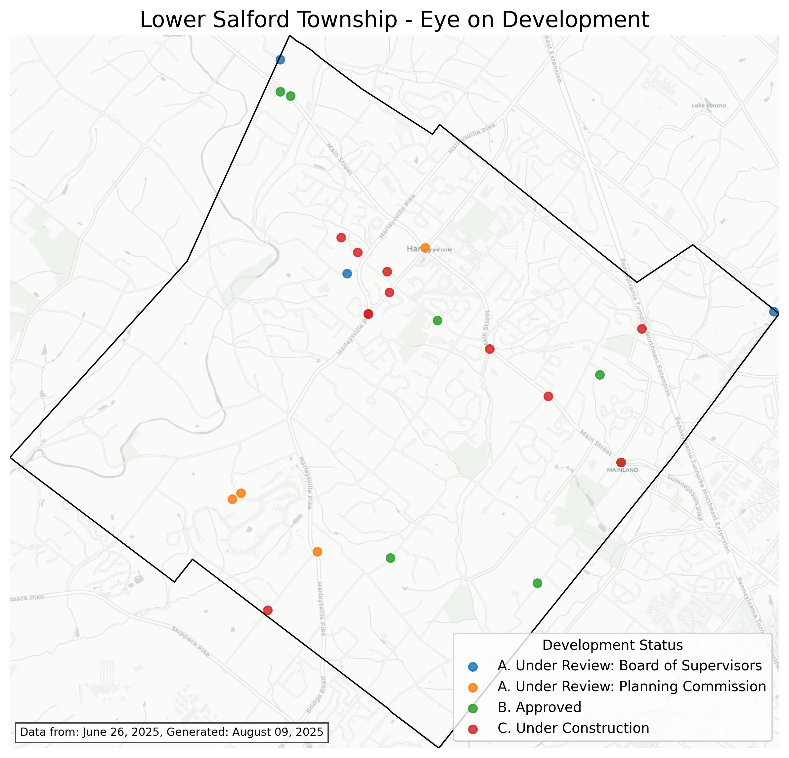

# Eye on Development

## Overview

**Eye on Development** is a toolset and API for visualizing development activity in Lower Salford Township, PA.  It scrapes the [Eye on Development](https://www.lowersalfordtownship.org/departments/building-zoning/eye-on-development/) page, geocodes locations, and renders a map with color-coded markers by process stage.   You can use it as a command-line tool, as a REST API, or run it as a Docker container.

---

## Features

- **Web Scraping:** Extracts development entries from the township website.
- **Geocoding:** Uses OpenStreetMap Nominatim to get GPS coordinates.
- **Map Rendering:** Produces a JPG map with township borders, basemap tiles, and development markers.
- **REST API:** Exposes endpoints for integration and automation.
- **Docker Support:** Run the entire stack in a container as Flask API.

---

## Usage

### 1. Command Line

Install dependencies:

```sh
pip install -r requirements.txt
```

**Extract entries:**
```sh
python3 extract.py
```

Saves to the file `development_entries.json`.

**Geocode entries:**
```sh
python3 nominatim.py
```

Saves to the file `development_entries_geocoded.json` using previous saved version as a makeshift cache file, and `development_corrections.json` (if exists) as an override.

**Render map:**
```sh
python3 render.py
```

The final map will be saved as `development_map_with_basemap.jpg`.

**Combine all these steps (optional)**  
Or run all these steps in a combined library at once using:
```sh
python3 eye.py
```

---

### 2. API Server

Start the API server (example with Flask):

```sh
python3 app.py
```

**Endpoints:**

- `GET /`  
  Returns the interactive UI index page.

- `POST /eye`  
  Accepts JSON with `source_url` and `corrections`, returns link to the `/image` URL.

- `GET /image`  
  Returns the latest generated map JPG.


---

### 3. Docker

Build and run the container:

```sh
docker build -t eyeondev .
docker run -p 8080:8080 eyeondev
```

The API will be available at `http://localhost:8080`.

---

## Example Output



---

## Troubleshooting

- On macOS, you may need to install `proj` for `pyproj`:
  ```sh
  brew install proj
  ```

---

## Files

- `extract.py` — Scrapes development entries.
- `nominatim.py` — Geocodes entries.
- `render.py` — Renders the map.
- `app.py` — API server.
- `Dockerfile` — Container build.
- `lower_salford_boundary.geojson` — Township boundary.
- `requirements.txt` — Python dependencies.

---

## License

MIT License. See [LICENSE](LICENSE) for details.